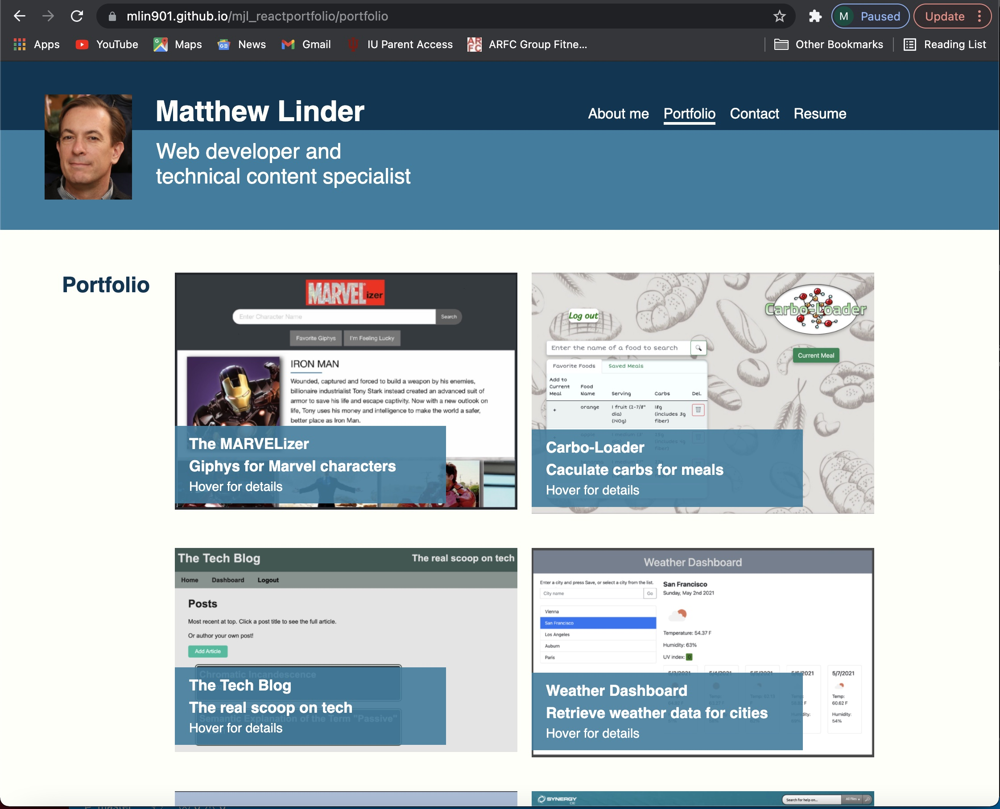

# mjl-reactportfolio

Published portfolio: https://mlin901.github.io/mjl_reactportfolio/

## Table of Contents

&nbsp;&nbsp;&nbsp;&nbsp;&nbsp;[Description](#description) 
&nbsp;&nbsp;&nbsp;&nbsp;&nbsp;[What comes next?](#what-comes-next) 
&nbsp;&nbsp;&nbsp;&nbsp;&nbsp;[Questions](#questions) 
&nbsp;&nbsp;&nbsp;&nbsp;&nbsp;[Screenshot](#screenshot) 

## Description

This is a rewrite of my portfolio using React, so the most significant changes are under the hood. There are, however, some more visible changes. For example, the portfolio now has four pages created by React: 

- An "About me" page with my brand statement
- A Portfolio page that highlights recent projects
- A Contact page that is currently under construction. (It includes a contact form, but that form does not result in a message.)
- A Resume page that lists my full stack technology competencies and provides a link to my resume

Additionally, the footer features GitHub, LinkedIn, and Stack Overflow links, as well as contact information. 

## What comes next?

The portfolio needs a facelift in general. A clean, simple integration of Bootstrap elements with a carefully chosen color scheme would really help, and that's what I plan to do next. After that, I plan to perform similar facelifts on the projects featured on the portfolio page. 

## Questions

Send questions to mjlinder218@gmail.com. 
For more information about the developer, see https://github.com/mlin901.

## Screenshot 

